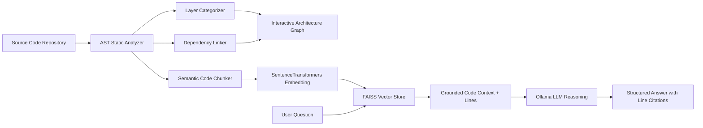

# CodeMap AI

[](https://hacktoberfest.com/)
[](LICENSE)
[](https://www.python.org/)
[](https://fastapi.tiangolo.com/)
[](https://react.dev/)
[](https://ollama.ai/)

> An AI-powered visual codebase navigator for understanding unfamiliar projects.

---

## Problem

Joining a new engineering team, jumping into an open-source project, or inheriting legacy code often feels overwhelming:
- **Spaghetti Dependencies**: Developers spend hours or days manually following imports, function definitions, and API calls across dozens of folders.
- **Outdated Documentation**: Architecture diagrams in READMEs or wikis are frequently stale, incomplete, or missing entirely.
- **Fear of Breaking Changes**: Modifying a utility, route, or model is risky when you cannot clearly visualize all downstream consumers.
- **Privacy and IP Concerns**: Sending proprietary codebases to third-party cloud LLMs violates corporate NDAs, security compliance policies, and incurs recurring API costs.

---

## Solution

**CodeMap AI** transforms complex, unfamiliar repositories into an **interactive, multi-tier architectural map** and provides a **context-grounded local AI assistant**:
- **Automatic Multi-Tier Layout**: Categorizes files into clean architectural layers (*Frontend UI*, *API Endpoints*, *Services*, *Data Models*, *Config*).
- **Cross-Layer Data Flow**: Traces connections from client-side network calls (`fetch`/`axios`) to backend routes (`@app.get`, Express endpoints) and database models.
- **100% Private Local RAG**: Powered by local vector search (FAISS + SentenceTransformers) and open-weight models (**Ollama** / Qwen / Gemma / Llama) — running entirely on your machine at zero cost.
- **Exact Line-Number Citations**: Every explanation cites verifiable source code references with interactive file previews.
- **Side-by-Side Inspection**: Review source code in one pane while conversing with the AI assistant in the adjacent pane without overlapping.

---

## Features

- **Multi-Source Ingestion**: Load repositories via **Local Directory**, **GitHub URL** (fast shallow clone), or drag-and-drop **ZIP Archive**.
- **Interactive Architecture Graph**: Pan, zoom, and explore a tiered DAG layout powered by React Flow and Dagre.
- **Multi-Language AST Parsing**: Extracts classes, functions, imports, route handlers, and schemas for Python, JavaScript, TypeScript, JSX/TSX, Java, JSON, YAML, and SQL.
- **Cross-Layer Call Flow**: Identifies and connects frontend dispatchers to backend endpoint handlers.
- **Grounded AI Explainer**: Ask natural-language questions about data flows, authentication, or business logic.
- **Exact Line-Level Citations**: Interactive badges cite file paths and line ranges (e.g., `routes/auth.py:L7-14`) with jump-to-source inspection.
- **Fuzzy Symbol Search (`Ctrl + K` / `Cmd + K`)**: Instantly locate functions, classes, routes, and files with graph auto-focus.
- **Side-by-Side Dual Pane**: Inspect source code and chat with the AI assistant simultaneously without UI clutter.
- **Zero Cloud Lock-in**: Works 100% air-gapped on your laptop with open-source tools.

---

## Architecture

```
                      ┌────────────────────────────────────────────────────────┐
                      │              Frontend (React + Vite)                   │
                      │  ┌───────────────────┐        ┌─────────────────────┐  │
                      │  │ React Flow Canvas │        │ Side-by-Side Drawer │  │
                      │  │ (Tiered Graph)    │        │ (Code & AI Chat)    │  │
                      │  └─────────┬─────────┘        └──────────┬──────────┘  │
                      └────────────┼─────────────────────────────┼─────────────┘
                                   │ REST / JSON API (http://127.0.0.1:8000)
                      ┌────────────▼─────────────────────────────▼─────────────┐
                      │                 FastAPI Backend                        │
                      │  ┌───────────────────┐        ┌─────────────────────┐  │
                      │  │ Repo Ingestion    │        │ Graph Builder       │  │
                      │  │ (Local/Git/ZIP)   │        │ (Nodes & Relations) │  │
                      │  └─────────┬─────────┘        └──────────▲──────────┘  │
                      │            │                             │             │
                      │  ┌─────────▼─────────┐        ┌──────────┴──────────┐  │
                      │  │ Code Parser (AST) ├───────►│ Dependency Resolver │  │
                      │  └─────────┬─────────┘        └─────────────────────┘  │
                      │            │                                           │
                      │  ┌─────────▼─────────┐        ┌─────────────────────┐  │
                      │  │ Semantic Chunking ├───────►│ RAG Engine (FAISS)  │  │
                      │  └───────────────────┘        └──────────┬──────────┘  │
                      │                                          │             │
                      │                               ┌──────────▼──────────┐  │
                      │                               │ Local Ollama Service│  │
                      │                               │ (Qwen3 / Gemma2)    │  │
                      │                               └─────────────────────┘  │
                      └────────────────────────────────────────────────────────┘
```

---

## Tech Stack

### Frontend
- **Framework**: React 18 with Vite
- **Graph Visualization**: React Flow (`@xyflow/react`) + Dagre graph layout engine
- **Syntax Highlighting**: PrismJS
- **Icons**: Lucide React
- **Styling**: Cyber-Dark Glassmorphism & High-Contrast Design System

### Backend
- **Framework**: Python 3.11+ & FastAPI
- **Static Analysis**: Python `ast`, regex AST tokenizers, language parsers
- **Network Routing**: Uvicorn ASGI Server
- **Schema Validation**: Pydantic v2

### AI & Vector Retrieval
- **Local LLM Engine**: [Ollama](https://ollama.ai/) (`qwen3:4b`, `gemma2:2b`, `llama3.2`, `phi4-mini`)
- **Embeddings**: `SentenceTransformers` (`all-MiniLM-L6-v2`)
- **Vector Search**: FAISS (Facebook AI Similarity Search)
- **Fallback Engine**: Smart Built-in AST Architectural Synthesizer & Cloud API fallback (Groq / Gemini)

---

## How It Works



1. **Ingest**: The backend scans source files, ignoring lockfiles, virtual environments, and build artifacts.
2. **Parse**: Static AST analysis extracts functions, classes, imports, exported routes, and database schemas.
3. **Graph**: The dependency resolver connects import chains and cross-layer API endpoints, positioning nodes across 5 distinct tiers.
4. **Index**: Code chunks are embedded with `all-MiniLM-L6-v2` and stored in a local FAISS index.
5. **Reason**: When queried, relevant code snippets and line ranges are retrieved and passed to Ollama for grounded explanations.

---

## Installation

### Prerequisites
- **Python 3.10+**
- **Node.js 18+** and `npm`
- *(Optional, Recommended)* [Ollama](https://ollama.ai/) with your preferred open-weight model:
  ```bash
  ollama pull qwen3:4b
  # or
  ollama pull gemma2:2b
  ```

---

### One-Click Launch (Windows)
Run the automated startup script from the root directory:
```powershell
.\run_app.bat
```

*(For Linux/macOS, run `./run_app.sh`)*

---

### Manual Setup

#### 1. Backend Setup
```bash
cd backend
python -m venv venv

# On Windows:
.\venv\Scripts\activate
# On Linux/macOS:
source venv/bin/activate

pip install -r requirements.txt
```

Create a `.env` file in `backend/.env`:
```env
OLLAMA_BASE_URL=http://localhost:11434
DEFAULT_LLM_MODEL=qwen3:4b
EMBEDDING_MODEL=all-MiniLM-L6-v2
```

Start the FastAPI server:
```bash
python run.py
```
Backend runs at `http://127.0.0.1:8000` (Swagger docs: `http://127.0.0.1:8000/docs`).

#### 2. Frontend Setup
```bash
cd frontend
npm install
npm run dev
```
Frontend runs at `http://localhost:5173`.

---

## Usage

1. **Open the Web UI**: Visit `http://localhost:5173`.
2. **Ingest a Repository**:
   - **Local Directory**: Enter any local project path (e.g., `C:\Projects\MyProject` or `/home/user/app`).
   - **Preset Samples**: Choose bundled full-stack demo projects for immediate offline testing.
   - **GitHub URL**: Paste any public Git repository link.
   - **ZIP Archive**: Drag and drop a compressed codebase.
3. **Explore the Graph**:
   - Pan and zoom across the tiered canvas.
   - Follow cyan edges representing frontend-to-backend API routes.
   - Follow purple edges representing data model relationships.
4. **Inspect Source Code**:
   - Click any node to open the **Node Details Drawer** with syntax-highlighted code and call references.
5. **Ask AI (`Ctrl + K` / AI Explainer)**:
   - Click **Ask AI** or open the **AI Explainer** drawer.
   - Ask questions like:
     - *"How does user authentication work in this repo?"*
     - *"Trace the data flow from login to the database."*
     - *"Where are the external API integrations located?"*
   - Click on any **Grounded Reference badge** to jump straight to that file and line range.

---

## Project Structure

```
CodeMap/
├── backend/
│   ├── app/
│   │   ├── api/                   # FastAPI route controllers
│   │   │   ├── routes_repo.py     # Ingestion & sample management
│   │   │   ├── routes_graph.py    # Graph nodes & edges endpoint
│   │   │   ├── routes_chat.py     # AI chat & RAG queries
│   │   │   └── routes_search.py   # Symbol & fuzzy code search
│   │   ├── core/                  # Core engines
│   │   │   ├── file_scanner.py    # Multi-language directory scanner
│   │   │   ├── ast_parser.py      # Static AST & symbol extractor
│   │   │   ├── graph_builder.py   # Architecture tier & edge resolver
│   │   │   ├── rag_engine.py      # Chunking, FAISS & vector index
│   │   │   ├── llm_client.py      # Ollama, Groq & offline synthesizer
│   │   │   └── repo_manager.py    # In-memory repository state manager
│   │   ├── schemas/               # Pydantic data schemas
│   │   │   ├── repo.py
│   │   │   ├── graph.py
│   │   │   └── chat.py
│   │   ├── config.py              # Environment configuration & limits
│   │   └── main.py                # FastAPI app initialization
│   ├── requirements.txt
│   ├── run.py                     # Backend entry point
│   └── .env                       # Local LLM & server settings
├── frontend/
│   ├── src/
│   │   ├── components/
│   │   │   ├── CustomNodes/       # Custom React Flow node components
│   │   │   ├── Navbar.jsx         # Header, active repo badge & layout toggle
│   │   │   ├── GraphView.jsx      # Interactive canvas & minimap
│   │   │   ├── NodeDetailDrawer.jsx # Source code preview & details
│   │   │   ├── AIChatDrawer.jsx   # Side-by-side RAG explainer
│   │   │   ├── SearchBar.jsx      # Ctrl+K modal symbol finder
│   │   │   └── RepoInputModal.jsx # Multi-source repository ingestion
│   │   ├── services/
│   │   │   └── api.js             # Axios client with proxy routing
│   │   ├── utils/
│   │   │   └── layout.js          # Dagre hierarchical layout engine
│   │   ├── App.jsx                # Main layout coordinator
│   │   ├── index.css              # Cyber-dark theme & design tokens
│   │   └── main.jsx
│   ├── package.json
│   └── vite.config.js
├── sample_repos/                  # Pre-configured offline demonstration fixtures
├── run_app.bat                    # 1-Click Windows launcher
├── run_app.sh                     # 1-Click Linux/macOS launcher
├── IMPLEMENTATION_PLAN.md         # Architecture blueprint
└── README.md
```

---

## Privacy & Security

- **100% Local & Air-Gapped**: Code parsing, AST extraction, vector indexing, and LLM inference occur entirely on `localhost`.
- **No Data Leakage**: Your proprietary code is never sent to external servers or third-party APIs.
- **Enterprise Ready**: Safe for NDA-bound codebases, healthcare/HIPAA projects, fintech applications, and air-gapped workstations.

---

## Future Improvements

- [ ] **Git Diff Impact Analysis**: Highlight which components and downstream files are affected by a specific branch or pull request.
- [ ] **Automated Test Generator**: Generate unit tests directly from AST call paths and parameter schemas.
- [ ] **VS Code Extension**: Embed CodeMap's interactive canvas directly inside the VS Code sidebar.
- [ ] **Dynamic Runtime Tracing**: Ingest OpenTelemetry traces to overlay live request latencies on top of AST nodes.

---

## License

Distributed under the **MIT License**. See [LICENSE](LICENSE) for details.

Built for **Hacktoberfest 2026** — *Build for a Friend*.
